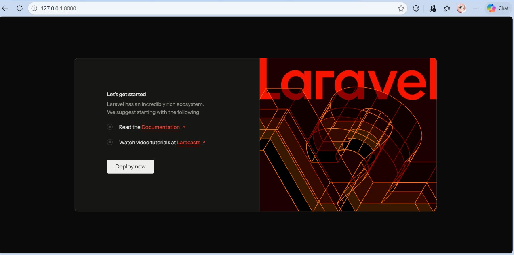
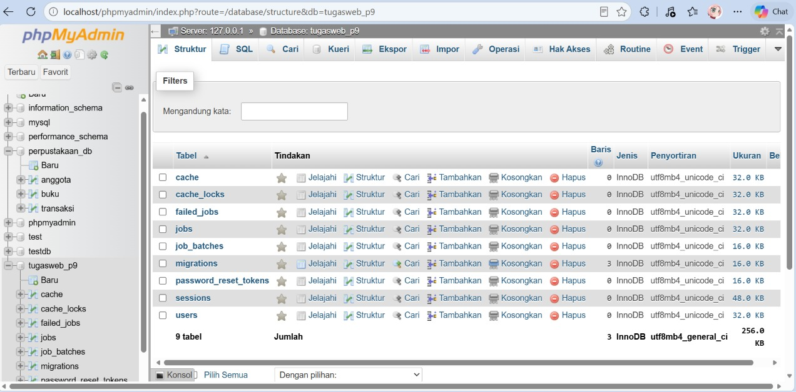
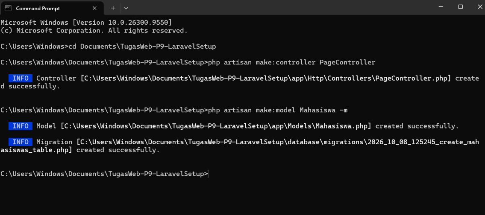
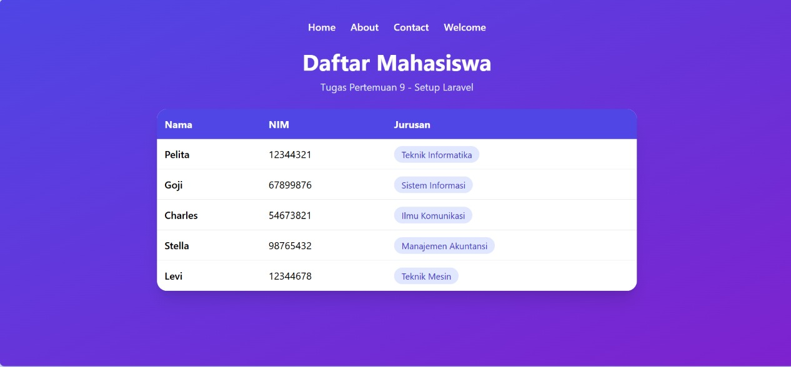
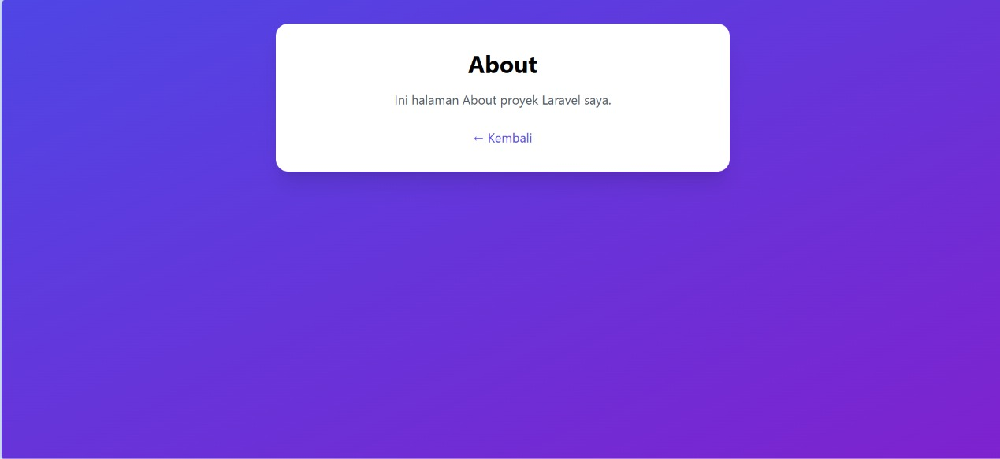

# TugasWeb-P9-LaravelSetup

Tugas Rutin 9 (Pertemuan 9): Setup Laravel.

**Nama:** [Yesy Pelita Estela Pardede]
**NIM:** [4253250017]

## Deskripsi

Project Laravel sederhana yang berisi 3 route custom (`/`, `/about`, `/contact`) yang mengembalikan Blade view, dengan data dinamis berupa array dari route yang ditampilkan dalam tabel. Styling memakai Tailwind CDN.

## Teknologi

- PHP 8.2
- Laravel 12
- MySQL (XAMPP + phpMyAdmin)
- Composer
- Tailwind CSS (CDN)

## Langkah Install

1. Install **XAMPP** (PHP 8.2 atau lebih baru), lalu jalankan **Apache** dan **MySQL**.
2. Install **Composer** dari getcomposer.org.
3. Aktifkan extension `zip` di `C:\xampp\php\php.ini` (hapus tanda `;` pada `;extension=zip`).
4. Buat project Laravel:

```bash
   composer create-project laravel/laravel TugasWeb-P9-LaravelSetup
   cd TugasWeb-P9-LaravelSetup
```

5. Buat database `tugasweb_p9` di phpMyAdmin (`http://localhost/phpmyadmin`).
6. Atur koneksi database di file `.env`:

```env
   DB_CONNECTION=mysql
   DB_HOST=127.0.0.1
   DB_PORT=3306
   DB_DATABASE=tugasweb_p9
   DB_USERNAME=root
   DB_PASSWORD=
```

7. Jalankan migrasi:

```bash
   php artisan migrate
```

8. Jalankan server:

```bash
   php artisan serve
```

9. Buka `http://127.0.0.1:8000` di browser.

Catatan: jika project ini di-clone dari GitHub, jalankan `composer install`, salin `.env.example` menjadi `.env`, lalu `php artisan key:generate` sebelum langkah 5 sampai 8.

## Daftar Route

| URL | Keterangan |
|-----|------------|
| `/` | Halaman utama, menampilkan data mahasiswa (array dari route) |
| `/about` | Halaman About |
| `/contact` | Halaman Contact |
| `/welcome` | Halaman welcome dengan styling Tailwind |
| `/hello/{nama}` | Bonus: route parameter, menyapa sesuai nama di URL |

## Perintah Artisan yang Dipakai

```bash
php artisan make:controller PageController
php artisan make:model Mahasiswa -m
```

## Struktur Folder

| Folder / File | Fungsi |
|---------------|--------|
| `app/Http/Controllers/` | Berisi controller, tempat logika halaman (contoh: `PageController.php`) |
| `app/Models/` | Berisi model untuk berinteraksi dengan database (contoh: `Mahasiswa.php`) |
| `database/migrations/` | Berisi file migration untuk membuat struktur tabel |
| `resources/views/` | Berisi tampilan Blade (`home`, `about`, `contact`, `welcome`, `hello`) |
| `routes/web.php` | Tempat mendefinisikan route web |
| `public/` | Folder yang diakses publik, berisi `index.php` sebagai pintu masuk aplikasi |
| `config/` | File konfigurasi aplikasi |
| `storage/` | Menyimpan log, cache, dan file upload |
| `vendor/` | Library hasil instalasi Composer (jangan diedit) |
| `.env` | Pengaturan environment, termasuk koneksi database |
| `artisan` | Perintah CLI Laravel |
| `composer.json` | Daftar dependency project |

## Screenshots

### Welcome Page (Laravel)


### Database phpMyAdmin


### Perintah Artisan


### Halaman Home


### Halaman About


### Halaman Contact

